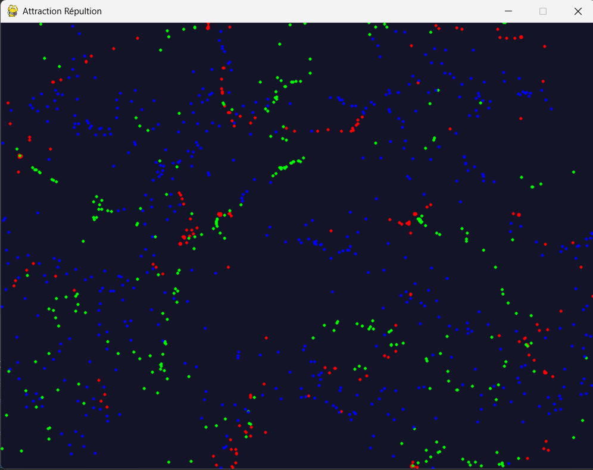
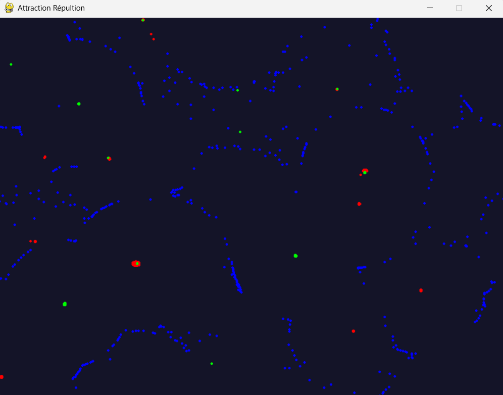

# 🌀 Attraction–Repulsion Simulation with GPU Acceleration


  

  
  

---

## 📝 Project Description  
This project is an **interactive particle simulation** based on **attraction and repulsion forces** between groups of particles.  

It uses **CUDA via Numba** for GPU acceleration ⚡ to handle thousands of particles in real-time, rendered with Pygame.  

Particles move on a **toroidal (wrap-around) world**, influenced by configurable attraction matrices. The simulation creates emergent swarms, clusters, and chaotic dynamics.  

This project was create to learn how to use my GPU in Python and to search for emergence systems !

---

## ⚙️ Features
  🧲 Attraction and repulsion forces between particle groups  

  ⚡ GPU acceleration with **Numba CUDA** kernels  

  🔄 Toroidal wrapping (particles reappear on opposite side of the screen)  

  🎨 Real-time visualization with Pygame  

  🧪 Configurable interaction matrix for emergent patterns  

---

## 🎮 Example Screenshots  
Here’s a preview of what the simulation looks like:  

  

  

---

## ⚙️ How it works  
  🔹 Particles are split into groups (red, green, blue).  

  🔹 Each group interacts with others based on an **interaction coefficient matrix**:  
  - Positive → attraction  
  - Negative → repulsion  
  - Zero → neutral  

  🔹 Forces are computed in parallel on the GPU using **Numba CUDA kernels**.  

  🔹 Particle velocities are updated with **friction damping**, and positions are updated with toroidal wrapping.  

  🔹 The result is a dynamic simulation where **order and chaos emerge** from simple rules.  


---

## 📂 Repository structure  
```bash
├── img/                      # For the README
│   ├── img.png
│   └── img_1.png
│
├── attraction_repulsion.py
│
├── LICENSE
├── README.md
```

---

## 💻 Run it on Your PC  
Clone the repository and install dependencies:  
```bash
git clone https://github.com/Thibault-GAREL/Attraction_repulsion.git
cd Attraction_repulsion

python -m venv .venv # if you don't have a virtual environment
source .venv/bin/activate   # Linux / macOS
.venv\Scripts\activate      # Windows

pip install numpy pygame numba
```

⚠️ You need a **CUDA-compatible GPU** with Numba configured for GPU acceleration.  

Run the simulation:  
```bash
python main.py
```

---

## 📖 Inspiration / Sources  
This project was coded from scratch as a **personal experiment in emergent behavior** with GPU acceleration.  

I see on youtube a video about it : 
- [How Particle Life emerges from simplicity](https://www.youtube.com/watch?v=p4YirERTVF0)  
- [Simuler l'origine de la vie, systèmes de particules et automates cellulaires](https://www.youtube.com/watch?v=Jdaz5e_a5xk)  

😆 100% coded without tutorials!
